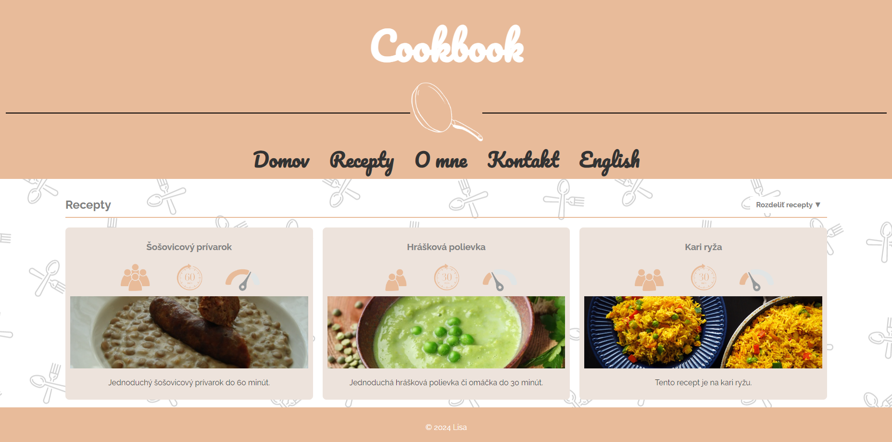

#  CookBook Web App
A cookbook web app for recepies from me living as a student.

##  Technologies

- VisualStudio Code
- GitHub
- Html
- Css
- Procreate

##  Features

This is what you can do with the CookBook web app:

- **Find recipe**: Click recipes and find your recipe you want to do.
- **Shopping list**: At the recipe you want to do, you can check out the ingredients you already bought.
- **Preparation**: At the recipe you want to do, you can check out the parts of the preparation process so you know what you have already done.
- **Sort recipes**: By clicking sort recipes, you can sort out recipes depending on your preferations.
- **Change language**: Click english in the menu by hovering over the pan image and you will get to an english version of this web app.

##  Process

I started by sketching out in Procreate a simple layout of the window with the main layout of recipes.

As the next steps, I slowly implemented the main functions, so the web app would star functioning. 

I started taking pictures of each step in the progress of recipes and sketching simple icons for definition of each recipe as an timer, portions or even the dificuly.

In the final process, I implemented the background for more appealing look..

Along the way, I took notes on what should be improved in the future.

##  Running the app

[CookBook by Frede](https://kmetovafrede.github.io/cookbyfrede/)

##  Improvements

- Making more recipes and implementing them
- Finishing the english version

##  Screenshots

